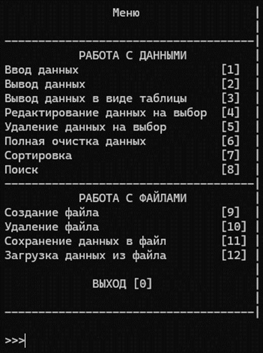
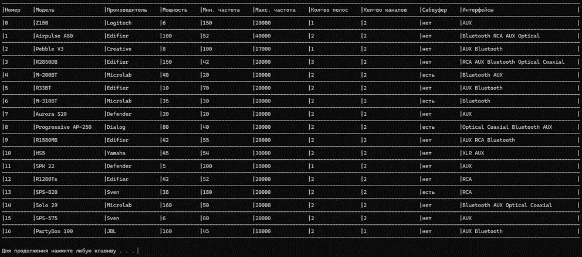

# Информационная система «Акустические системы»

Консольное приложение на C++ для хранения, поиска, сортировки и файловой обработки данных об акустических системах. 

Приложение написано с использованием собственного динамического стека на указателях (без использования сторонних контейнеров STL) и разделено на понятные модули.

---

## Основные возможности

- **Управление записями (CRUD):** 
  - Пошаговый ввод с поддержкой названий на русском и английском языках, числовых параметров и флагов.
  - Редактирование любого выбранного поля существующей записи.
  - Поштучное удаление элементов или полная очистка базы данных в памяти.
- **Удобный вывод:**
  - Табличный вид с автоматическим выравниванием колонок для просмотра всего списка.
  - Форматированный вывод одной выбранной записи в формате `Поле: Значение`.
- **Поиск и фильтрация:** Поиск по любому из 9 параметров (модель, бренд, мощность, диапазон частот, динамики, каналы, сабвуфер, интерфейсы).
- **Сортировка:** Двунаправленная сортировка по всем характеристикам (по возрастанию / убыванию или по алфавиту / против алфавита).
- **Работа с файлами:** Создание, удаление, сохранение и загрузка базы данных из `.txt` файлов.
- **Защита от некорректного ввода:** Встроенная проверка типов данных с выводом понятных сообщений об ошибках.

---

## Архитектура и Реализация

Программа построена по принципам процедурного программирования с чистым разделением на функциональные модули:

### Собственный динамический стек
База данных в оперативной памяти реализована в виде самописной структуры данных **Стек (LIFO)** на указателях (`stack.cpp`):
- Каждая запись `acoustic_system` оборачивается в узел `node`, где хранится значение и указатель на следующий элемент.
- Функции `stack_push`, `stack_pop`, `stack_peek`, `stack_clear` обеспечивают выделение и очистку динамической памяти без утечек.

### Модульность
Проект разделен на 7 логических модулей:
- **`acoustic_system.cpp`** — доменная модель и структуры данных.
- **`stack.cpp`** — низкоуровневая работа со стеком.
- **`as_db.cpp`** — сохранение, загрузка и работа с файлами на диске.
- **`as_sorting.cpp`** — алгоритмы сортировки.
- **`as_finding.cpp`** — алгоритмы поиска и фильтрации.
- **`as_io.cpp`** — форматированный консольный ввод/вывод и валидация.
- **`menu.cpp`** — интерактивное меню и обработка команд.

---

## Модель данных

Каждая акустическая система содержит 9 характеристик:
- **Модель** (`string`)
- **Производитель** (`string`)
- **Мощность** (`int`, Вт)
- **Мин. / Макс. частота** (`int`, Гц)
- **Количество полос / каналов** (`int`)
- **Наличие сабвуфера** (`bool`)
- **Поддерживаемые интерфейсы** (`input_interface*`) — динамический массив разъемов (`AUX`, `RCA`, `Optical`, `Coaxial`, `Bluetooth`, `HDMI`, `XLR`).

---

## Сборка и запуск

### Требования
- Компилятор C++ с поддержкой C++11 или выше (GCC, Clang, MSVC).
- Среда разработки **Visual Studio 2022** (или любое другое IDE).
- Операционная система: Windows 10 / 11.

### Запуск через Visual Studio
1. Откройте файл решения (`.sln`) в **Visual Studio 2022**.
2. Убедитесь, что выбрана конфигурация **Release** или **Debug** (x64 / x86).
3. Нажмите `Ctrl + Shift + B` для сборки.
4. Нажмите `Ctrl + F5` для запуска программы.

---

## Автор

- **Студент:** Ермолович И.Н. (Группа 23-СТ)
- **Университет:** Полоцкий государственный университет имени Евфросинии Полоцкой
- **Специальность:** Информационные системы и технологии
